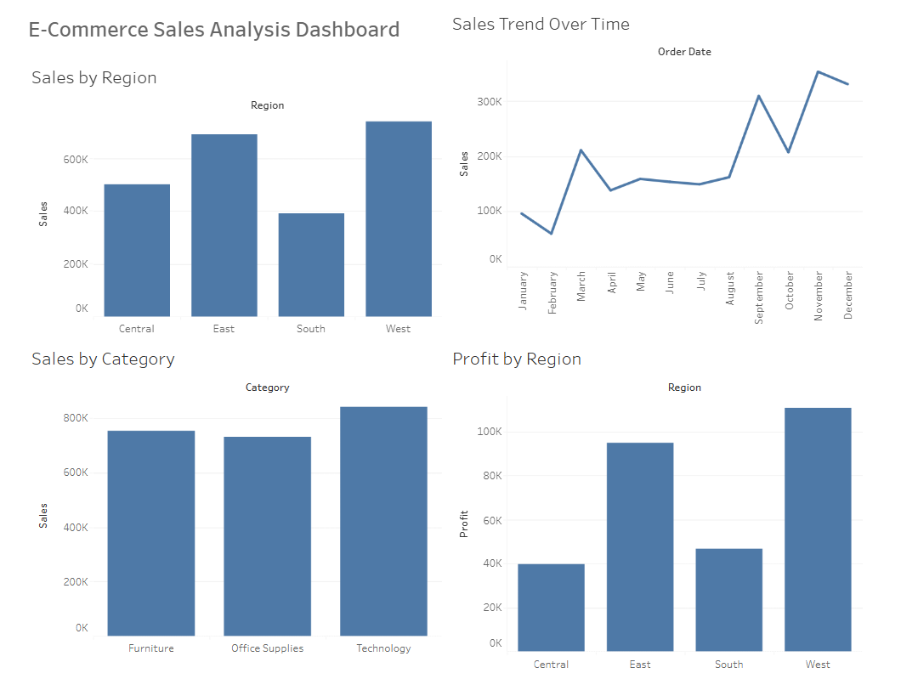

# E-Commerce Sales Analysis

E-Commerce Sales and customer data analysis using Tableau.

## Project Overview

This project analyzes e-commerce sales data to understand sales performance across different categories, regions, and time periods.

The analysis helps identify sales trends and compare regional and category-wise performance.

## Tools Used

- Tableau Public
- Microsoft Excel
- GitHub

## Key Analysis

- Sales by Category
- Sales by Region
- Sales Trend Over Time
- Profit by Region

## Tableau Dashboard

View the interactive dashboard:

[E-Commerce Sales Analysis](https://public.tableau.com/app/profile/savitha.katravath/viz/E-CommerceSalesAnalysis_17884570758390/Dashboard1)

## Dataset

The repository contains the datasets used for the analysis:

- `ecommerce_orders.csv`
- `sample_-_superstore.xls`

## Key Insights

- Technology has the highest sales among the major categories.
- West and East regions show strong sales performance.
- Sales vary across months, with noticeable increases during some periods.
- Regional profitability can be compared using the dashboard.

## Project Files

| File | Description |
|---|---|
| `ecommerce_orders.csv` | E-commerce order data |
| `sample_-_superstore.xls` | Superstore sales dataset |
| `README.md` | Project documentation |
